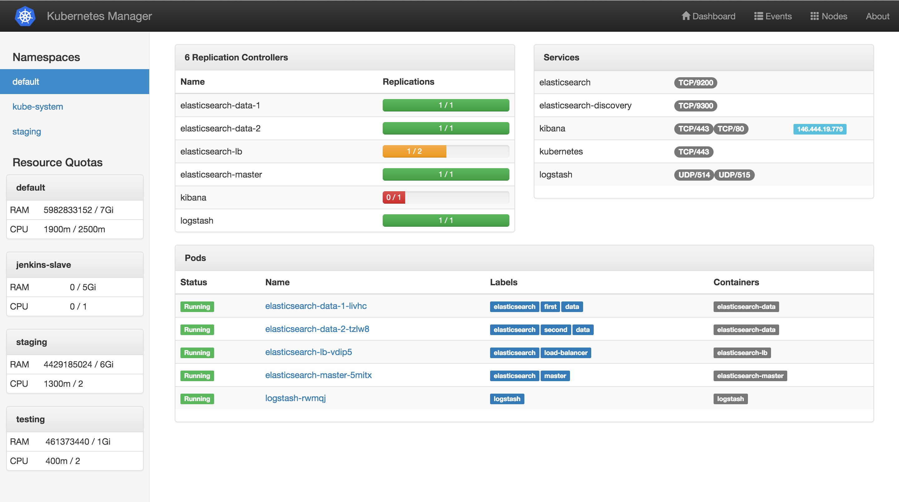
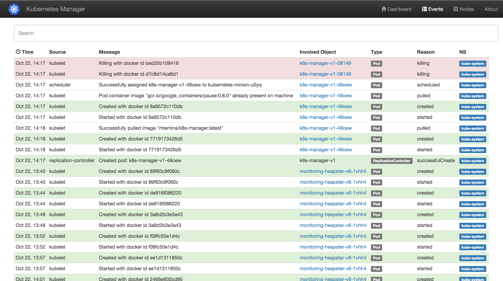
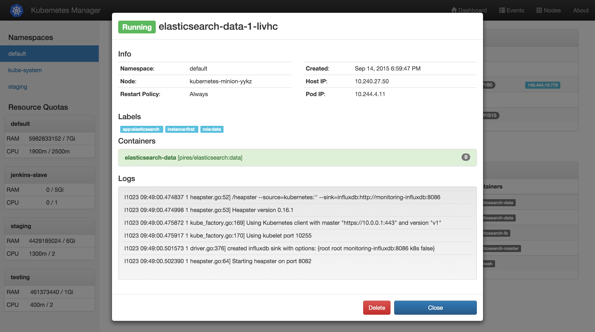

DISCLAMER: This project is just a weekend project and does not claim to be well tested or production-ready
in any way.

# Kubernetes Manager

This project is a browser-based interface to the [Kubernetes](http://kubernetes.io/) API. The idea is
to provide most of the functionality of the `kubectl.sh` command-line tool. Additionally, it should give
you a quick overview of the health status of your Kubernetes cluster.

## Screenshots

### Dashboard

### Events

### Pod Details

## Installation

Kubernetes Manager is meant to be run as a Kubernetes
[Cluster Addon](https://github.com/kubernetes/kubernetes/tree/master/cluster/addons).

### Prerequisites

You need a running Kubernetes cluster. See [kubernetes.io](http://kubernetes.io/) for details.

IMPORTANT: (Heapster monitoring)[https://github.com/kubernetes/heapster] needs to be enabled!

### Copy the .yml files to your Kubernetes Master
 
TODO

### Start Service and Resource Controller

`cd` to the project root and execute `kubectl create -f k8s-manager`. After a few seconds, you should find the URL
to your Kubernetes Manager here:

`kubectl cluster-info`

## Development

Kubernetes Manager is built using [AngularJS](https://angularjs.org/). Please feel free to fork this repository,
ask me questions or submit pull requests!

### TODOs

* Write proper unit tests
* Write end-to-end tests
* Configure Grunt build process for JS and CSS minification
* Create modal detail views for resource controllers
* Create modal detail views for services
* Make resource controllers scalable with slider